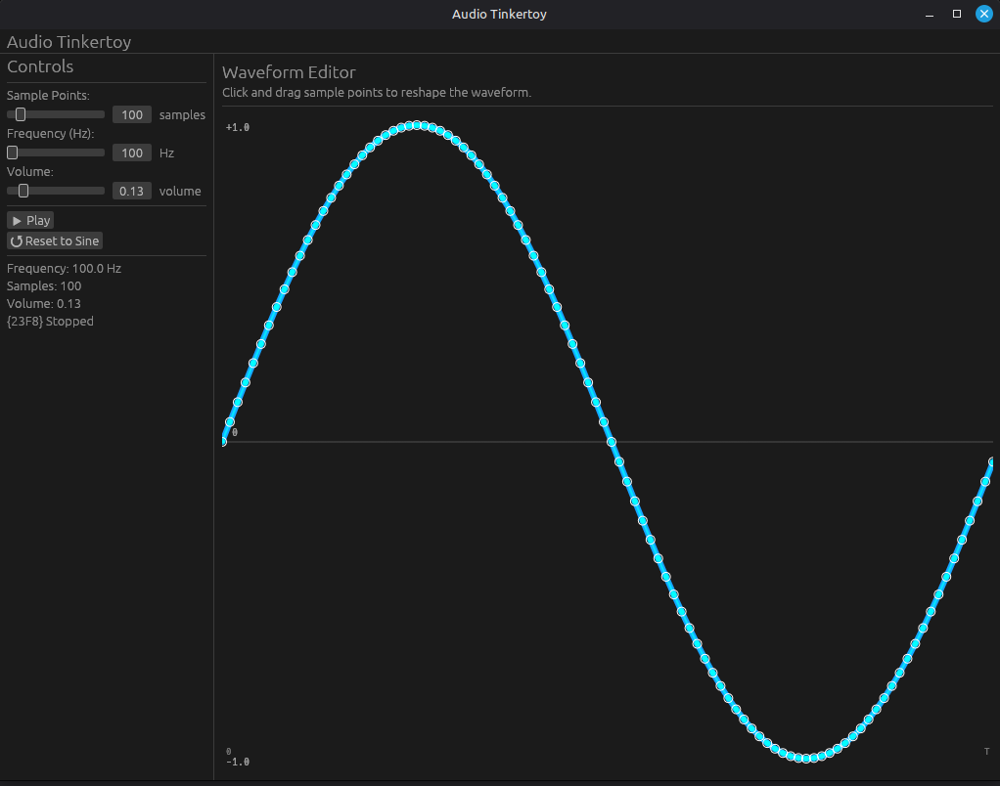
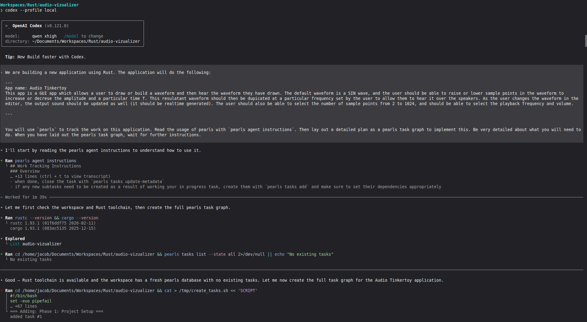

# Audio Tinkertoy
This is a a simple audio toy that I built as a test of local LLM capabilities on consumer hardware. 

## What was the point?
See the [blog post](https://www.linkedin.com/pulse/ive-changed-my-mind-local-llms-jacob-calvert-rgzbe/) for the gory details, but basically: I wanted to give a "real" task to a local model on consumer hardware and just see what it could do. I gave a simple prompt and one [planning tool](https://crates.io/crates/pearls) and turned it loose. I was so surprised that it built this that I had to share it. 

## What it Does

This is a GUI app built in Rust that allows you to manipulate the waveform of a sinusoid and hear the difference "live". You can also adjust the frequency, the volume, the number of samples, etc.  

## Other Images
### Initial Prompt via Codex w/Local Model

